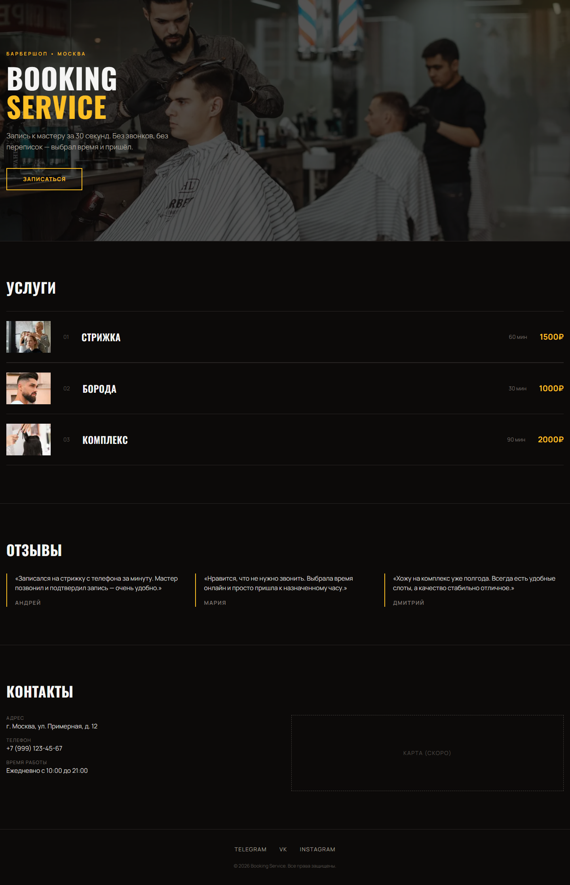
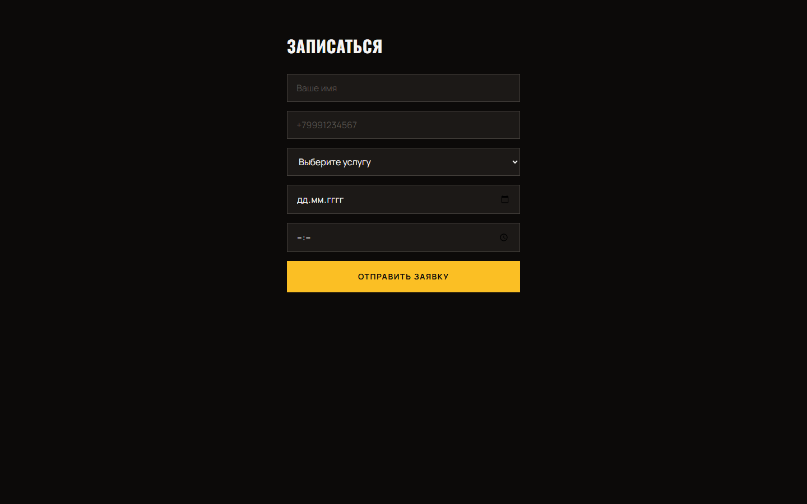
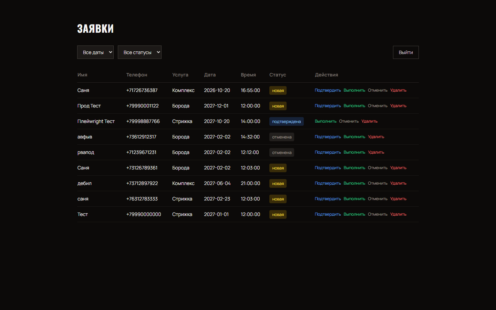

# Booking Service

Мини-SaaS для онлайн-записи малого бизнеса (барбершопы, салоны, стоматологии, автосервисы).
Клиент записывается с телефона за 30 секунд, владелец видит заявки в админке и получает уведомления в Telegram.

🔗 **Демо:** https://booking-service-lemon.vercel.app

## Скриншоты

| Главная | Форма записи | Админка |
|---------|--------------|---------|
|  |  |  |

## Возможности

- 📱 Адаптивный лендинг: Hero, услуги, отзывы, контакты, футер.
- 📝 Форма записи с валидацией (имя, телефон `+7…`, дата не в прошлом, время 09:00–21:00).
- 🛡 Rate limit: не более 3 заявок с одного IP в час (429).
- 💾 Запись в Supabase, RLS: аноним — только INSERT, авторизованный владелец — полный доступ.
- 🔔 Telegram-уведомления владельцу о новых заявках.
- 🔐 Админка `/admin` с Supabase Auth, статусами `new/confirmed/done/cancelled`, фильтрами по дате и статусу.
- ✅ Юнит-тесты валидаторов, API и Telegram-хелпера (Vitest).

## Стек

- [Next.js 15](https://nextjs.org/) (App Router) + React 19
- TypeScript
- Tailwind CSS
- Supabase (Postgres + Auth + RLS)
- Telegram Bot API
- Vitest, ESLint, Prettier
- Деплой: Vercel

## Быстрый старт

```bash
git clone <repo-url>
cd booking-service
npm install
cp .env.example .env.local   # заполнить значения
npm run dev                  # http://localhost:3000
```

Схему БД применить в Supabase SQL Editor: `supabase/migrations/001_bookings.sql`.

## Переменные окружения

| Переменная | Назначение |
|---|---|
| `NEXT_PUBLIC_SUPABASE_URL` | URL проекта Supabase |
| `NEXT_PUBLIC_SUPABASE_ANON_KEY` | Публичный anon-ключ |
| `SUPABASE_SERVICE_ROLE_KEY` | Service role (только сервер!) |
| `TELEGRAM_BOT_TOKEN` | Токен бота от @BotFather |
| `TELEGRAM_CHAT_ID` | Chat ID владельца |

`.env.local` добавлен в `.gitignore` — ключи не попадут в репо.

## Скрипты

```bash
npm run dev    # dev-сервер
npm run build  # production build
npm run start  # запуск production build
npm run lint   # ESLint
npm run format # Prettier
npm run test   # Vitest
```

## Структура

```
app/
  (public)/page.tsx        лендинг
  book/page.tsx            форма записи
  admin/page.tsx           список заявок
  admin/login/page.tsx     логин
  api/bookings/route.ts    POST заявки
components/
  sections/                секции лендинга
  admin/                   таблица заявок
lib/
  supabase.ts  telegram.ts  validators.ts  rateLimit.ts
types/index.ts
tests/                     Vitest-спеки
supabase/migrations/       SQL-миграция
middleware.ts              защита /admin/*
scripts/screenshots.cjs    генерация скриншотов
screens/                   скриншоты для README
```

## Тесты

```bash
npm run test
```

Покрыто: валидация формы, rate limit (429), API-контракт (400/201/429), Telegram-хелпер с моком fetch.

## Деплой

Проект задеплоен на Vercel. Для своей копии:

```bash
npm i -g vercel
vercel login
vercel          # preview
vercel --prod   # production
```

Переменные окружения добавить в Vercel Dashboard → Settings → Environment Variables.

## Лицензия

MIT
